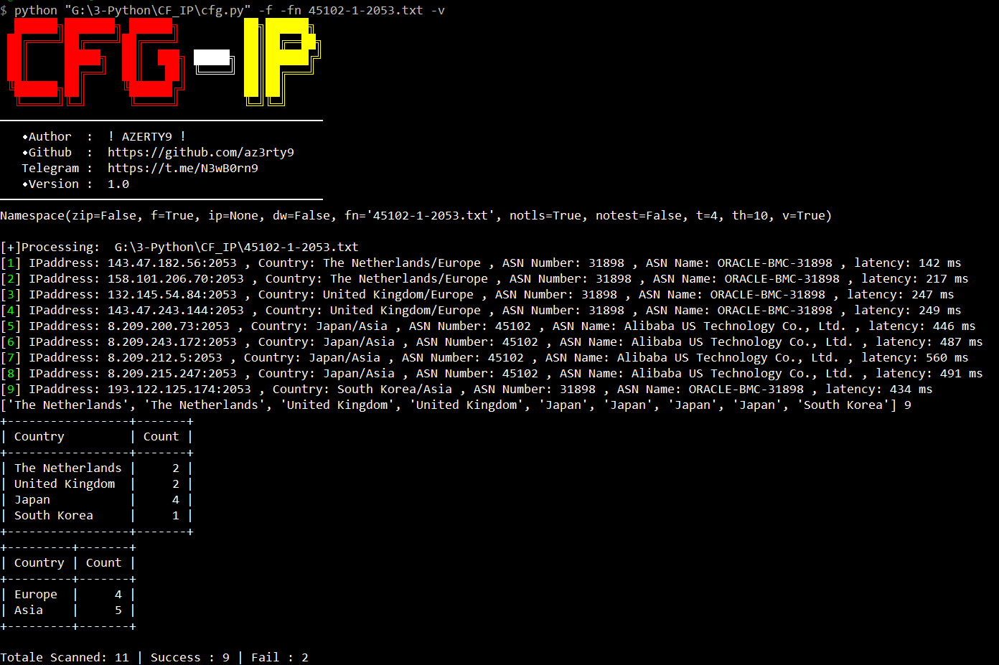

# CFG-IP 

CFG-IP is a Python script designed to test provided CF’s anti-generation IP or automatically download a daily-updated anti-CF IP list from https://zip.baipiao.eu.org. The script retrieves the ASN (Autonomous System Number) and geographical information for each IP using the GeoIP2 library. Then organizes the results into a folder structure based on the date and time of the scan, with each IP's information stored in a separate text file named after its country.

## Requirements

- Python 3.x
- [GeoIP2 Python library](https://github.com/maxmind/GeoIP2-python)
- [argparse](https://docs.python.org/3/library/argparse.html)

To install the required library, use pip:

```sh
pip install geoip2 argparse
```

# Usage
- Clone this repository:
```
git clone https://github.com/az3rty9/CFG-IP.git
```
```
cd CFG-IP
```
### Run the script:
The script supports multiple argument combinations:

- To scan a single IP address, use the following command:

```
python cfg.py -ip <ip_address>
```

- To download a ZIP file and scan all files within it:
  
```
python cfg.py -zip -dw
```

- To scan a ZIP file in the same directory with the name `txt.zip`:
 
```
python cfg.py -zip
```
  
- To scan a ZIP file in the same directory with a given name (e.g., filename.zip):

```
python cfg.py -zip -fn filename.zip
```

- To scan all text files in the same directory:
  
```
python cfg.py -f
```

- To scan a text file in the same directory with a given name (e.g., filename.txt):

```
python cfg.py -f -fn filename.txt
```

# Output
The script will create a folder structure organized by the date and time of the scan. Each IP's information will be stored in a separate text file named after its country.

- For example:

```
2024-04-02/
    ├── 2024-04-01_23-48-54/
    │   ├── Hong Kong_2024-04-01_23-59-58.txt
    │   ├── Japan_2024-04-01_23-53-01.txt
    │   └── ...
    └── 2024-04-01_23-59-58/
        ├── Germany_2024-04-01_23-59-58.txt
        ├── France_2024-04-01_23-59-58.txt
        └── ...
```

# Screenshot




# License
This project is licensed under the MIT License - see the LICENSE file for details

